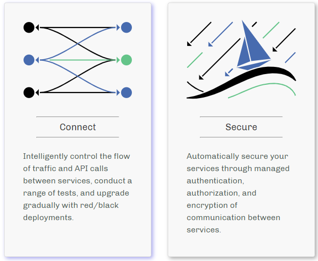
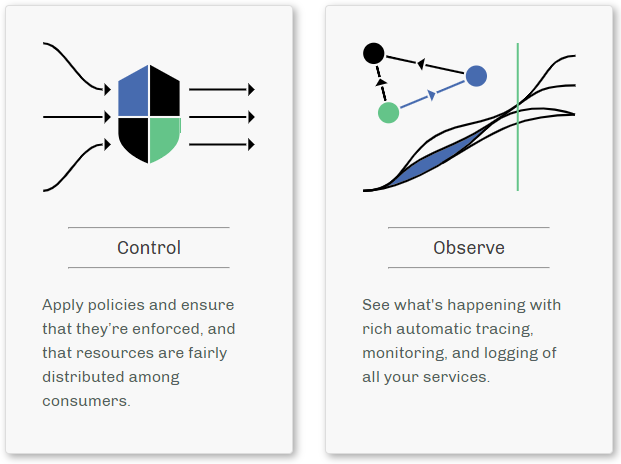
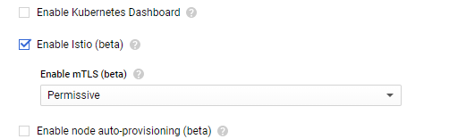
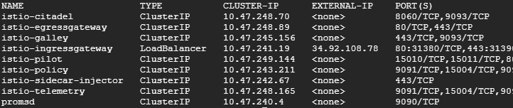
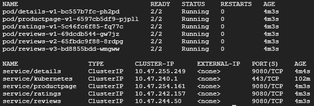

name: inverse
layout: true
class: center, middle, inverse-red

---
# Istio Service Mesh
# Introduction

---
layout: false
### Required

- Basic knowledge of Kubernetes

### Targets

People who:

- don't know Service Mesh

- have never used Istio

---
### Contents

1. What is Service Mesh?

1. What is Istio?

1. Setup using Istio on GKE

1. Sample Application

1. Traffic Management Example

---
class: center, middle, inverse-red
## What is Service Mesh?

---
### Microservices?

- Loosely coupled

- Independently deployable

- Organized around business capabilities

- Implemented using different programming languages

- Continuous delivery/deployment of large, complex applications

---
### Service Mesh?

Describe the network of microservices that make up applications and the interactions between them

- Service Discovery

- Load Balancing

- Failure Recovery

- Metrics and Monitoring

---
### Service Mesh?

More complex operational requirements

- A/B Testing

- Canary Rollouts

- Rate Limiting

- Access Control

- End-to-end Authentication

---
class: center, middle, inverse-red
## What is Istio?

---
### Istio

.right-small[
<center></center>
]

.left-large[
- Open source independent service mesh

- Deployed as sidecars in the Pods

- CNCF hosted project(Envoy)
]

---
### Istio

Connect, secure, control, and observe services

.left-half[
<center></center>
]

.right-half[
<center></center>
]

---
class: header-margin
### Architecture

<center></center>

---
### Architecture

.zoom2[
- Data plane

    - Envoy

- Control plane

    - Mixer

    - Pilot

    - Citadel

    - Galley
]

---
### Envoy

A high-performance proxy developed in C++

.right-small[
<center></center>
]

.left-large[
- Deployed as a sidecar in the Kubernetes Pod

- Add to an existing deployment with no need to rearchitect or rewrite code
]

---
### Envoy

Features

- Dynamic Service Discovery

- Load Balancing

- TLS Termination

- HTTP/2 and gRPC proxies

---
### Envoy

- Circuit Breakers

- Health Checks

- Staged Rollouts with %-based Traffic Split

- Fault Injection

- Rich Metrics

---
### Mixer

Responsible for providing policy controls and telemetry collection

- Enforces access control and usage policies across the service mesh

- Collects telemetry data from the Envoy proxy and other services

- Includes a flexible plugin model

---
### Mixer

<center></center>

---
### Pilot

Provides service discovery for:

- Envoy sidecars
    
- Traffic management capabilities for intelligent routing  
(e.g. A/B Tests, Canary Rollouts)
    
- Resiliency  
(e.g. Timeouts, Retries, Circuit Breakers)

---
### Pilot

<center></center>

---
### Citadel

Strong service-to-service/end-user authentication with built-in identity and credential management

### Galley

Istio’s configuration validation, ingestion, processing and distribution component

---
class: center, middle, inverse-red
## Setup using Istio on GKE

---
### Set IAM

Set the default compute service account to include:

- roles/container.admin (Kubernetes Engine Admin)

- Editor (on by default)

---
class: header-margin
### Set IAM

<center></center>

---
### Create a Cluster

- Need 4 nodes

- Check "Enable Istio (beta)" on Advanced options

<center></center>

---
### Istio Resources

```console
$ kubectl get svc -n istio-system
```

<center></center>

or

```console
$ kubectl get po -n istio-system
```

---
### Install Istio

1. Go to the [Istio release](https://github.com/istio/istio/releases) page to download the installation file

1. Extract the downloaded installation file

1. Change directory to the root of the Istio installation

1. Add the istioctl client to the PATH:

```console
$ export PATH=$PWD/bin:$PATH
```

---
class: center, middle, inverse-red
## Sample Application

---
### Bookinfo

<center></center>

---
### Bookinfo

4 separate microservices:

- Productpage

- Details

- Reviews

- Ratings

---
### Bookinfo

3 versions of the Reviews microservice:

- Version v1  
doesn’t call the ratings service

- Version v2  
calls the ratings service, and displays black stars

- Version v3  
calls the ratings service, and displays red stars

---
### Deploy

Enable automatic sidecar injection:

```console
$ kubectl label namespace default \
  istio-injection=enabled
```

Deploy the application using kubectl:

```console
$ kubectl apply -f \
  samples/bookinfo/platform/kube/bookinfo.yaml
```

---
### Resources

Confirm all services and pods are running:

```console
$ kubectl get po,svc
```

<center></center>

---
### Define Ingress Gateway

```console
$ kubectl apply -f \
  samples/bookinfo/networking/bookinfo-gateway.yaml

$ kubectl get gateway
NAME               AGE
bookinfo-gateway   17s
```

---
class: center, middle, red
## Control Ingress Traffic

---
### Httpbin

HTTP testing service that can be used for experimenting with all kinds of Istio features

```console
$ kubectl apply -f samples/httpbin/httpbin.yaml
```

---
### Set variables

Set the ingress IP and ports:

.zoom1[
```console
$ export INGRESS_HOST=$(kubectl -n istio-system get service istio-ingressgateway -o jsonpath='{.status.loadBalancer.ingress[0].ip}')
$ export INGRESS_PORT=$(kubectl -n istio-system get service istio-ingressgateway -o jsonpath='{.spec.ports[?(@.name=="http2")].port}')
$ export SECURE_INGRESS_PORT=$(kubectl -n istio-system get service istio-ingressgateway -o jsonpath='{.spec.ports[?(@.name=="https")].port}')
```
]

---
### Create an Istio Gateway

.zoom1[
```console
kubectl apply -f - <<EOF
apiVersion: networking.istio.io/v1alpha3
kind: Gateway
metadata:
  name: httpbin-gateway
spec:
  selector:
    istio: ingressgateway # use Istio default gateway implementation
  servers:
  - port:
      number: 80
      name: http
      protocol: HTTP
    hosts:
    - "*"
EOF
```
]

---
### Configure routes

.zoom1[
```console
kubectl apply -f - <<EOF
apiVersion: networking.istio.io/v1alpha3
kind: VirtualService
metadata:
  name: httpbin
spec:
  hosts:
  - "*"
  gateways:
  - httpbin-gateway
  http:
  - match:
    - uri:
        prefix: /headers
    route:
    - destination:
        port:
          number: 8000
        host: httpbin
EOF
```
]

---
### Virtual Service

Contains the route rules that Allows traffic for path /headers

All other external requests will be rejected

.zoom1[
```console
$ export GATEWAY_URL=$INGRESS_HOST:$INGRESS_PORT

$ $ curl -I http://$GATEWAY_URL/headers
HTTP/1.1 200 OK
...

$ $ curl -I http://$GATEWAY_URL/status
HTTP/1.1 404 Not Found
...

```
]

---
### Bookinfo Web Page

http://$GATEWAY_URL/productpage

<center></center>

---
### Bookinfo Web Page

If you refresh the page several times, you should see different versions of reviews shown in productpage, presented in a round robin style

- red stars
- black stars
- no stars

since we haven’t yet used Istio to control the version routing.

---
### Apply default destination rules

Create default destination rules for the Bookinfo services:

```console
$ kubectl apply -f \
  samples/bookinfo/networking/destination-rule-all.yaml
```

Display the destination rules:

```console
$ kubectl get destinationrules -o yaml
```

---
class: center, middle, red
# Demo

---
class: center, middle, inverse-red
# Traffic Management Example

---
### Route to v1

Apply the virtual services:

```console
$ kubectl apply -f \
  samples/bookinfo/networking/virtual-service-all-v1.yaml
```

Display the defined routes:

```console
$ kubectl get virtualservices -o yaml
```

---
### Apply weight-based routing

Transfer 50% of the traffic from reviews:v1 to reviews:v3

```console
$ kubectl apply -f \
  samples/bookinfo/networking/virtual-service-reviews-50-v3.yaml
```

### Route based on user identity

```console
$ kubectl apply -f \
  samples/bookinfo/networking/virtual-service-reviews-test-v2.yaml
```

---
### Books

<center></center>

---
### Links

<u>[Microservice Architecture](https://microservices.io/index.html)</u>

<u>[Istio](https://istio.io/)</u>

<u>[Istio - Google Cloud](https://cloud.google.com/istio/)</u>

<u>[Istioサービスメッシュ入門](https://www.slideshare.net/yokawasa/istio-114360124)</u>

<u>[Installing Istio on GKE](https://cloud.google.com/istio/docs/istio-on-gke/installing)</u>

---
### Links

<u>[Install Istio on the Google Kubernetes Engine](https://istio.io/docs/setup/kubernetes/install/platform/gke/)</u>

<u>[Bookinfo Application](https://istio.io/docs/examples/bookinfo/)</u>

---
class: center, middle, red
# Thank You!
